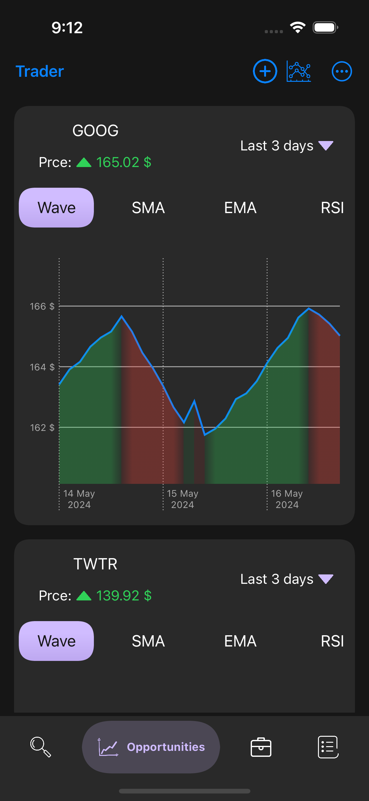
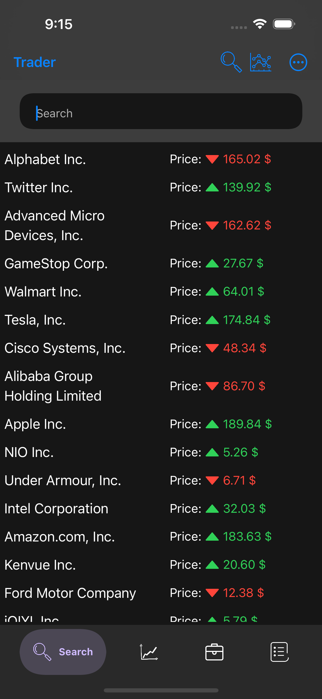
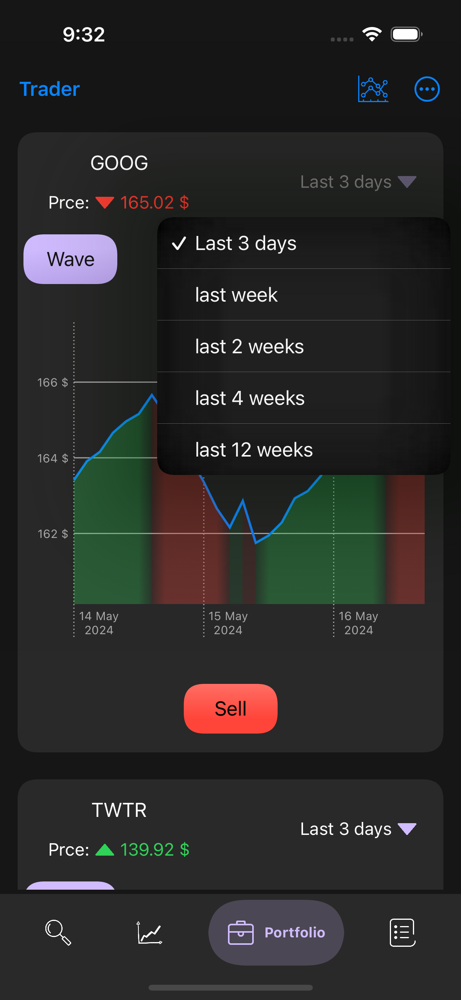
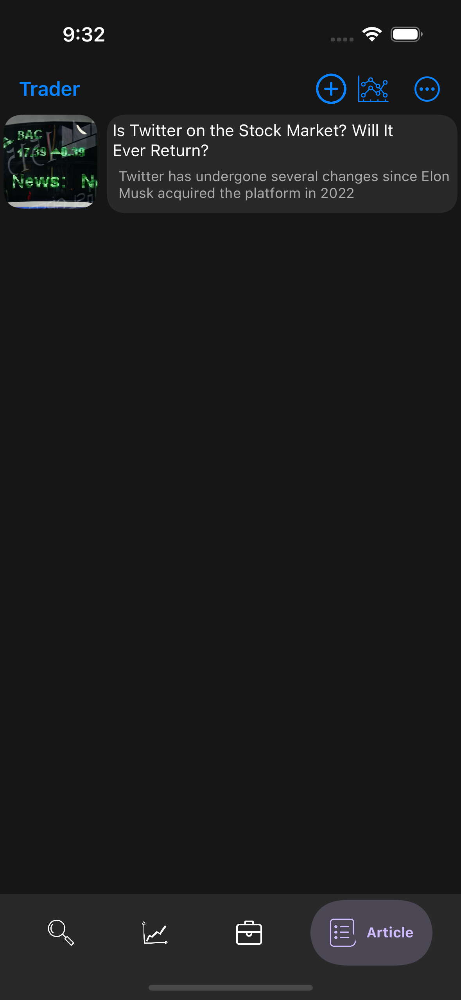
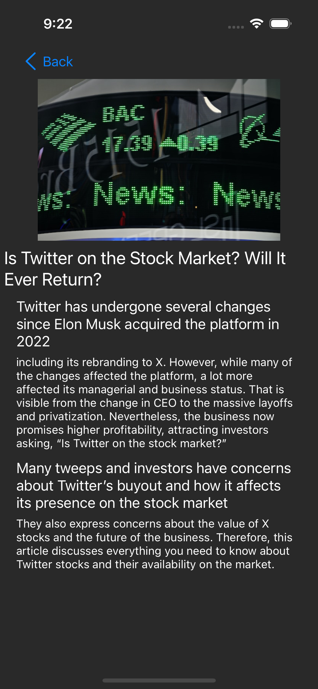
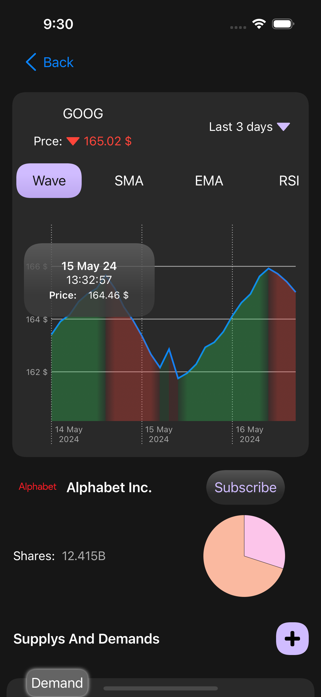
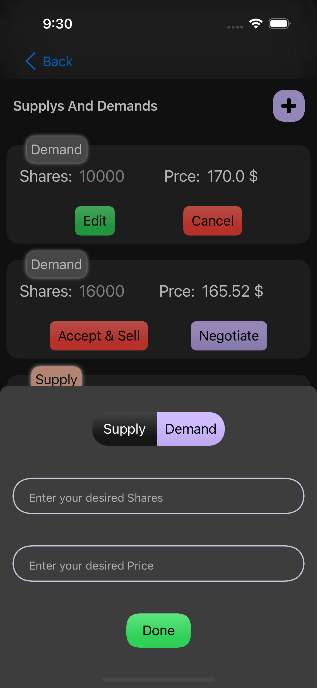
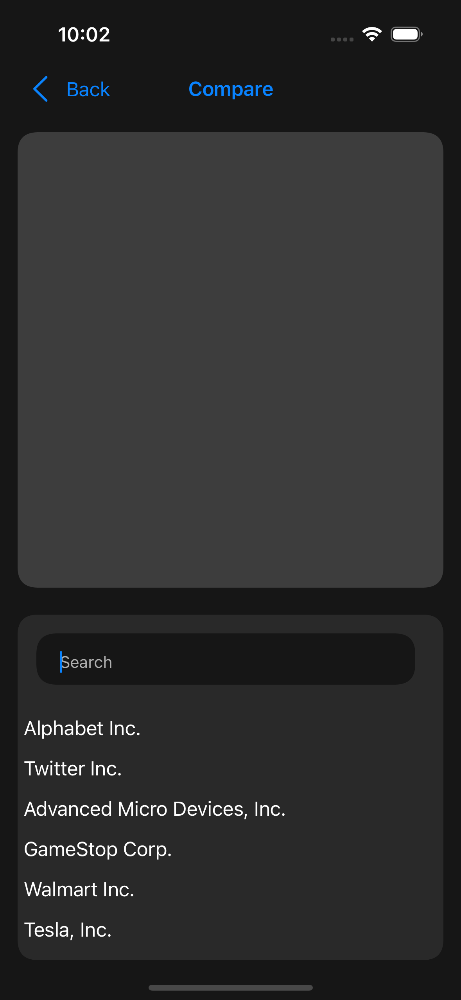

# 📉📈 Trader(Demo):   Finance IOS App For Traders And Stock Market

Mobile application for iOS devices built with Swift and SwiftUI that allows users to track the stock market, manage their personalized portfolios, and access financial tools and news analysis. Trader is a cutting-edge iOS app designed for traders and stock market enthusiasts. Developed using SwiftUI, MongoDB Realm, Swinject for dependency injection, and Charts API, it offers a suite of powerful features including Real-Time Data, Personalized Portfolio, Stocks News & Analysis, and Financial Tools.

## 🤩 Support Me

Features
--------

### Real-Time Data

*   Utilizes real-time data feeds to provide users with up-to-the-minute information on stock prices, market indices, and other financial metrics.
    
*   Updates are delivered seamlessly to ensure users have access to the most current data at all times.
    

### Personalized Portfolio

*   Allows users to create and manage personalized investment portfolios.
    
*   Supports features such as adding, removing, and tracking stocks within the portfolio.
    
*   Provides detailed insights into portfolio performance, including gains/losses, asset allocation, and historical trends.
    

### Stocks News & Analysis

*   Integrates with external APIs to fetch the latest news and analysis related to stocks and financial markets.
    
*   Provides users with curated content tailored to their interests and investment preferences.
    
*   Enables users to stay informed about market trends, company announcements, and industry developments.

Technologies Used
-----------------

*   **SwiftUI**: Apple's modern UI framework for building dynamic, native iOS apps, Leverages SwiftUI's declarative nature for a clean and efficient UI, allowing for a visually appealing and responsive user experience.
    
*   **MongoDB Realm**: A serverless platform for building reactive mobile applications, Utilizes MongoDB Realm as a robust mobile database solution. Realm offers offline capabilities, real-time synchronization, and a powerful query syntax for efficient data management..
    
*   **Swinject for Dependency Injection**: A lightweight dependency injection framework for Swift projects, Implements Swinject for dependency injection, promoting a modular and testable codebase. Swinject facilitates decoupling of components and simplifies dependency management.
    
*   **Charts API for Data Visualization**: A powerful charting library for displaying financial data and trends, Integrates the Charts library for creating interactive charts and graphs. Visualize stock price movements, portfolio performance, and technical indicators..
    

Installation
------------

1.  Clone the repository to your local machine.
    
2.  Open the project in Xcode.
    
3.  Ensure you have the necessary dependencies installed via Swift Package Manager.
    
4.  Build and run the app on a simulator or a physical device.
    

Configuration
-------------

1.  Set up MongoDB Realm instance and configure connection settings in the app.
    
2.  Customize UI/UX elements, themes, and layouts as per your branding requirements.
    
3.  Integrate additional APIs or data sources for enhanced functionality and feature expansion.
    
4.  Fine-tune performance optimizations and error handling mechanisms for a seamless user experience.
    

Usage
-----

1.  Upon launching the app, users can sign in or create a new account to access the platform.
    
2.  Navigate through different sections of the app, including real-time data, personalized portfolio, stocks news & analysis, and financial tools.
    
3.  Explore various features, interact with charts and data visualizations, and leverage tools for investment research and decision-making.
    
4.  Customize settings, preferences, and notifications to tailor the app experience to individual needs and preferences.

Screenshot
-------------

<table>
    <tr>
      <td>  </td>
      <td>  </td>
    </tr>
    <tr>
      <td>  </td>
      <td>  </td>
    </tr>
    <tr>
      <td>  </td>
      <td>  </td>
    </tr>
    <tr>
      <td>  </td>
      <td>  </td>
    </tr>
</table>
